# 🩷 DateNow : 데이트 코스 추천 웹 서비스

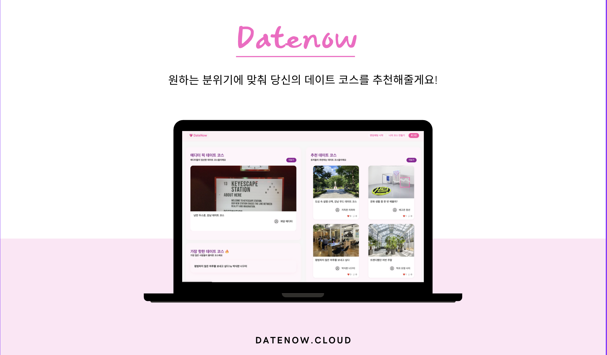

# 🔢 목차
### 1. 프로젝트 소개
### 2. 팀원
### 3. 주요 기능
### 4. 기술 스택
### 5. 폴더 구조
### 6. 시스템 아키텍처
### 7. ERD
### 8. API 명세서
### 9. 플로우차트
### 10. 화면정의서
### 11. 실행 방법

<br>

# 📝 1. 프로젝트 소개

**\<프로젝트 기간 : 2025/05/07 ~ 2025/06/18\>**

**DateNow**는 데이트 코스를 발견하고, 직접 만들고, 공유할 수 있는 데이트 플래닝 웹 서비스입니다.

AI 기반 데이트 장소 추천(RAG), 실시간 랜덤 채팅, 에디터 픽 코스 제공 등의 기능을 통해 사용자가 손쉽게 데이트를 계획할 수 있도록 돕습니다.

현재는 서울특별시 강남구에 위치한 200여개의 장소만 지원합니다.

**🌐 웹 서버** (`datenow`): Spring Boot / Java 21 — 메인 서비스 로직 및 UI 제공<br>
**📨 메일 서버** (`mail`): Spring Boot / Kotlin — Redis 이벤트 구독 후 이메일 발송 처리

<br>

# 💻 2. 팀원
프로그래머스 백엔드 데브코스 5기 6회차 8팀 I'Scrum

|    이름    |                                                 역할                                                 |
|:--------:|:--------------------------------------------------------------------------------------------------:|
| **최동준**  |        RAG 데이터 라벨링, LLM 장소 추천<br>에디터 픽 데이트 코스 기능 구현<br>게시물 비속어 필터링 기능 구현<br>회원가입 이메일 인증 구현         |
| **박승민**  |                     데이트 코스 편집 기능 구현<br>사용자 추천 코스 등록 구현<br>비밀번호 재설정 기능(SMTP) 구현                     |
| **손창민**  | JWT 인증 시스템 설계 및 구현<br>GitHub OAuth2 소셜 로그인 연동<br>회원가입, 회원정보 수정 구현<br>내가 만든 데이트 코스, 내가 찜한 코스 기능 구현  |
| **김가희**  |           회원 목록 조회 및 관리 기능 구현<br>게시물 찜하기 기능 구현<br>유저 페이지 및 관리자 페이지 구현<br>실시간 1:1 랜덤채팅 구현           |

<br>

# ✨ 3. 주요 기능
### 👤 회원
- 이메일 + 비밀번호 기반 일반 회원가입 / 로그인
- GitHub OAuth2 소셜 로그인
- 회원가입 시 이메일 인증
- 비밀번호 찾기 (임시 비밀번호 메일 발송)
- 마이페이지 (회원정보 수정, 내가 만든 데이트 코스, 내가 찜한 코스 관리)

<p>
    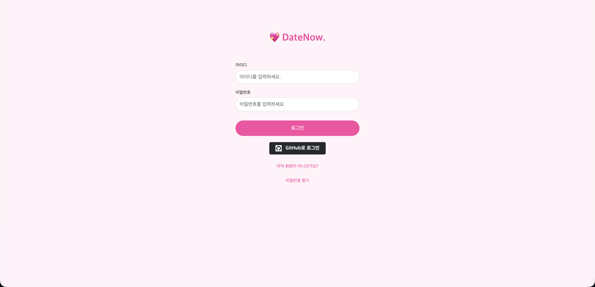
    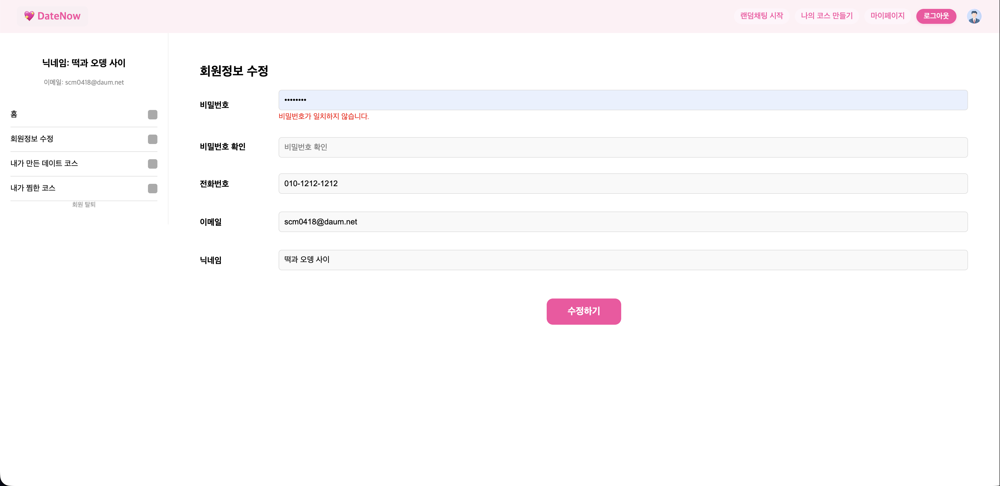
</p>

### 👫 데이트 코스
- 내가 만든 데이트 코스(나만 보기) 조회 / 삭제
- 내가 만든 데이트 코스를 추천 코스(전체 보기)로 등록
- 해시태그 기반 코스 분류
- 에디터 픽 코스, 사용자 추천 코스 목록 및 상세 조회
- 데이트 코스 찜하기 기능

<p>
  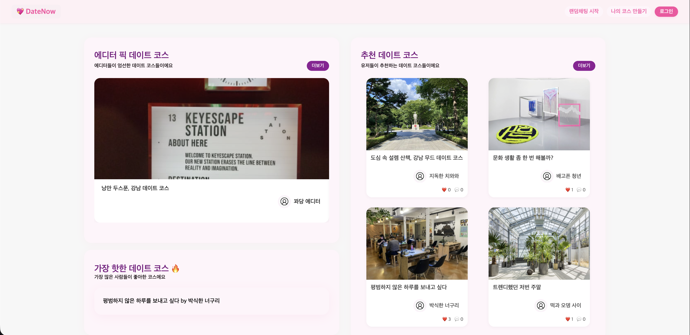
  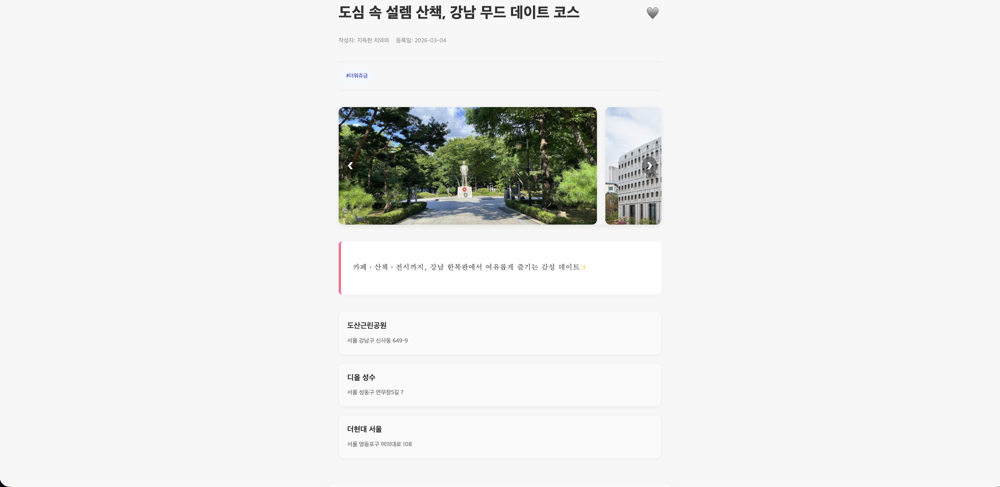
</p>

### 🤖 AI 데이트 장소 추천 (RAG)
- 분위기 입력 시 AI가 최대 5개의 데이트 장소 추천
- AllMiniLmL6V2 로컬 임베딩 모델로 벡터 변환
- MongoDB Atlas 벡터 검색으로 유사 장소 추출
- Google Gemini 2.5 Flash Lite로 최종 추천 생성

<p>
  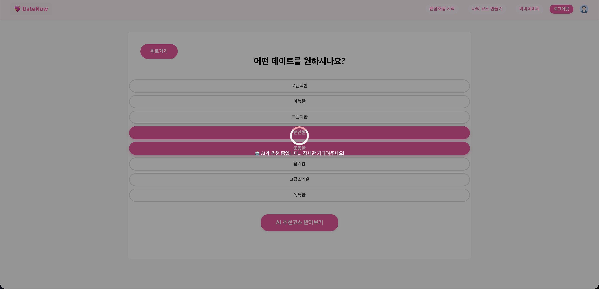
  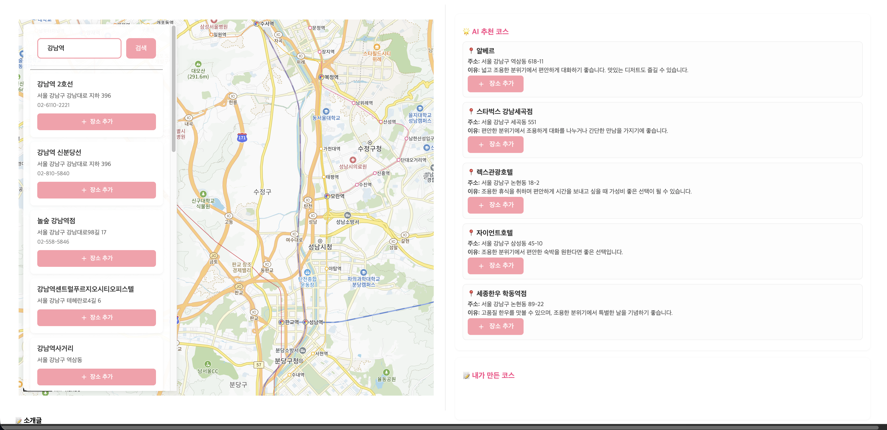
</p>

### 💬 실시간 채팅
- WebSocket(STOMP/SockJS) 기반 채팅방 생성 및 메시지 송수신
- Redis Pub/Sub을 통한 다중 서버 환경 지원

<p>
  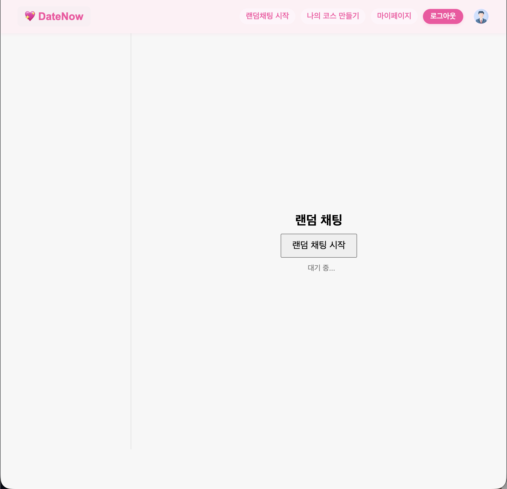
  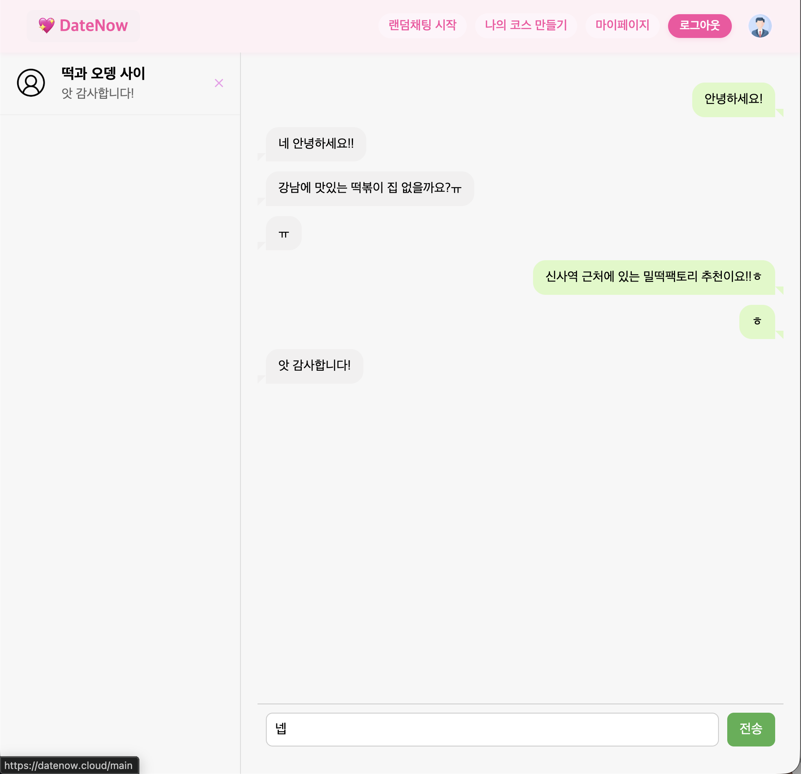
</p>

### 🔑 관리자
- 회원 목록 조회 / 관리
- 코스 목록 조회 / 관리

<br>

# 🛠️ 4. 기술 스택

## \<Backend\>

### Language
![Java](https://img.shields.io/badge/Java_21-007396?&style=for-the-badge&logo=data:image/svg%2bxml;base64,PCFET0NUWVBFIHN2ZyBQVUJMSUMgIi0vL1czQy8vRFREIFNWRyAxLjEvL0VOIiAiaHR0cDovL3d3dy53My5vcmcvR3JhcGhpY3MvU1ZHLzEuMS9EVEQvc3ZnMTEuZHRkIj4KDTwhLS0gVXBsb2FkZWQgdG86IFNWRyBSZXBvLCB3d3cuc3ZncmVwby5jb20sIFRyYW5zZm9ybWVkIGJ5OiBTVkcgUmVwbyBNaXhlciBUb29scyAtLT4KPHN2ZyB3aWR0aD0iMTUwcHgiIGhlaWdodD0iMTUwcHgiIHZpZXdCb3g9IjAgMCAzMi4wMCAzMi4wMCIgdmVyc2lvbj0iMS4xIiB4bWxucz0iaHR0cDovL3d3dy53My5vcmcvMjAwMC9zdmciIHhtbG5zOnhsaW5rPSJodHRwOi8vd3d3LnczLm9yZy8xOTk5L3hsaW5rIiBmaWxsPSIjZmZmZmZmIiBzdHJva2U9IiNmZmZmZmYiIHN0cm9rZS13aWR0aD0iMC4yNTYiPgoNPGcgaWQ9IlNWR1JlcG9fYmdDYXJyaWVyIiBzdHJva2Utd2lkdGg9IjAiLz4KDTxnIGlkPSJTVkdSZXBvX3RyYWNlckNhcnJpZXIiIHN0cm9rZS1saW5lY2FwPSJyb3VuZCIgc3Ryb2tlLWxpbmVqb2luPSJyb3VuZCIvPgoNPGcgaWQ9IlNWR1JlcG9faWNvbkNhcnJpZXIiPiA8cGF0aCBmaWxsPSIjZmZmZmZmIiBkPSJNMTIuNTU3IDIzLjIyYzAgMC0wLjk4MiAwLjU3MSAwLjY5OSAwLjc2NSAyLjAzNyAwLjIzMiAzLjA3OSAwLjE5OSA1LjMyNC0wLjIyNiAwIDAgMC41OSAwLjM3IDEuNDE1IDAuNjkxLTUuMDMzIDIuMTU3LTExLjM5LTAuMTI1LTcuNDM3LTEuMjN6TTExLjk0MiAyMC40MDVjMCAwLTEuMTAyIDAuODE2IDAuNTgxIDAuOTkgMi4xNzYgMC4yMjQgMy44OTUgMC4yNDMgNi44NjktMC4zMyAwIDAgMC40MTEgMC40MTcgMS4wNTggMC42NDUtNi4wODUgMS43NzktMTIuODYzIDAuMTQtOC41MDgtMS4zMDV6TTE3LjEyNyAxNS42M2MxLjI0IDEuNDI4LTAuMzI2IDIuNzEzLTAuMzI2IDIuNzEzczMuMTQ5LTEuNjI1IDEuNzAzLTMuNjYxYy0xLjM1MS0xLjg5OC0yLjM4Ni0yLjg0MSAzLjIyMS02LjA5MyAwIDAtOC44MDEgMi4xOTgtNC41OTggNy4wNDJ6TTIzLjc4MyAyNS4zMDJjMCAwIDAuNzI3IDAuNTk5LTAuODAxIDEuMDYyLTIuOTA1IDAuODgtMTIuMDkxIDEuMTQ2LTE0LjY0MyAwLjAzNS0wLjkxNy0wLjM5OSAwLjgwMy0wLjk1MyAxLjM0NC0xLjA2OSAwLjU2NC0wLjEyMiAwLjg4Ny0wLjEgMC44ODctMC4xLTEuMDIwLTAuNzE5LTYuNTk0IDEuNDExLTIuODMxIDIuMDIxIDEwLjI2MiAxLjY2NCAxOC43MDYtMC43NDkgMTYuMDQ0LTEuOTV6TTEzLjAyOSAxNy40ODljMCAwLTQuNjczIDEuMTEtMS42NTUgMS41MTMgMS4yNzQgMC4xNzEgMy44MTQgMC4xMzIgNi4xODEtMC4wNjYgMS45MzQtMC4xNjMgMy44NzYtMC41MSAzLjg3Ni0wLjUxcy0wLjY4MiAwLjI5Mi0xLjE3NSAwLjYyOWMtNC43NDUgMS4yNDgtMTMuOTExIDAuNjY3LTExLjI3Mi0wLjYwOSAyLjIzMi0xLjA3OSA0LjA0Ni0wLjk1NiA0LjA0Ni0wLjk1NnpNMjEuNDEyIDIyLjE3NGM0LjgyNC0yLjUwNiAyLjU5My00LjkxNSAxLjAzNy00LjU5MS0wLjM4MiAwLjA3OS0wLjU1MiAwLjE0OC0wLjU1MiAwLjE0OHMwLjE0Mi0wLjIyMiAwLjQxMi0wLjMxOGMzLjA3OS0xLjA4MyA1LjQ0OCAzLjE5My0wLjk5NCA0Ljg4Ny0wIDAgMC4wNzUtMC4wNjcgMC4wOTctMC4xMjZ6TTE4LjUwMyAzLjMzN2MwIDAgMi42NzEgMi42NzItMi41MzQgNi43ODEtNC4xNzQgMy4yOTYtMC45NTIgNS4xNzYtMC4wMDIgNy4zMjMtMi40MzYtMi4xOTgtNC4yMjQtNC4xMzMtMy4wMjUtNS45MzQgMS43NjEtMi42NDQgNi42MzgtMy45MjUgNS41Ni04LjE3ek0xMy41MDMgMjguOTY2YzQuNjMgMC4yOTYgMTEuNzQtMC4xNjQgMTEuOTA4LTIuMzU1IDAgMC0wLjMyNCAwLjgzMS0zLjgyNiAxLjQ5LTMuOTUyIDAuNzQ0LTguODI2IDAuNjU3LTExLjcxNiAwLjE4IDAgMCAwLjU5MiAwLjQ5IDMuNjM1IDAuNjg1eiIvPiA8L2c+Cg08L3N2Zz4=)


### Framework


### Build
-C71A36?logo=apachemaven&logoColor=white&style=for-the-badge)
-02303A?logo=gradle&logoColor=white&style=for-the-badge)

### ORM


### Security


### Real-time
![Web Socket](https://img.shields.io/badge/Web_Socket-000000?style=for-the-badge&logo=data:image/svg+xml;base64,PD94bWwgdmVyc2lvbj0iMS4wIiBlbmNvZGluZz0iVVRGLTgiIHN0YW5kYWxvbmU9Im5vIj8+CjwhLS0gVXBsb2FkZWQgdG86IFNWRyBSZXBvLCB3d3cuc3ZncmVwby5jb20sIEdlbmVyYXRvcjogU1ZHIFJlcG8gTWl4ZXIgVG9vbHMgLS0+Cjxzdmcgd2lkdGg9IjgwMHB4IiBoZWlnaHQ9IjgwMHB4IiB2aWV3Qm94PSIwIC0zMS41IDI1NiAyNTYiIHZlcnNpb249IjEuMSIgeG1sbnM9Imh0dHA6Ly93d3cudzMub3JnLzIwMDAvc3ZnIiB4bWxuczp4bGluaz0iaHR0cDovL3d3dy53My5vcmcvMTk5OS94bGluayIgcHJlc2VydmVBc3BlY3RSYXRpbz0ieE1pZFlNaWQiPgogICAgPGc+CiAgICAgICAgPHBhdGggZD0iTTE5Mi40NDAyMjMsMTQ0LjY0NDYxMiBMMjI0LjIyMDExMSwxNDQuNjQ0NjEyIEwyMjQuMjIwMTExLDY4LjMzOTMzODQgTDE4OC40MTUzMjksMzIuNTM0NTU2MiBMMTY1Ljk0MzAwNyw1NS4wMDY4Nzg1IEwxOTIuNDQwMjIzLDgxLjUwNDA5NDMgTDE5Mi40NDAyMjMsMTQ0LjY0NDYxMiBMMTkyLjQ0MDIyMywxNDQuNjQ0NjEyIFogTTIyNC4zMDM5NjMsMTYwLjU3NjQ4MiBMMTc4LjAxNzY4OCwxNjAuNTc2NDgyIEwxMTMuNDUxNjg3LDE2MC41NzY0ODIgTDg2Ljk1NDQ3MSwxMzQuMDc5MjY2IEw5OC4xOTA2MzIyLDEyMi44NDMxMDUgTDEyMC4wNzU5OTEsMTQ0LjcyODQ2NCBMMTY1LjEwNDQ4NywxNDQuNzI4NDY0IEwxMjAuNzQ2ODA2LDEwMC4yODY5MzEgTDEzMi4wNjY4Miw4OC45NjY5MTc4IEwxNzYuNDI0NSwxMzMuMzI0NTk5IEwxNzYuNDI0NSw4OC4yOTYxMDIyIEwxNTQuNjIyOTk0LDY2LjQ5NDU5NTUgTDE2NS43NzUzMDMsNTUuMzQyMjg2MyBMMTEwLjY4NDU3MywwIEw1Ni4zNDg1MDk3LDAgTDU2LjM0ODUwOTcsMCBMMCwwIEwzMS42OTYwMzY3LDMxLjY5NjAzNjcgTDMxLjY5NjAzNjcsMzEuNzc5ODg4NiBMMzEuODYzNzQwNiwzMS43Nzk4ODg2IEw5Ny40MzU5NjQ2LDMxLjc3OTg4ODYgTDEyMC42NjI5NTQsNTUuMDA2ODc4NSBMODYuNzAyOTE1Miw4OC45NjY5MTc4IEw2My40NzU5MjUzLDY1LjczOTkyNzkgTDYzLjQ3NTkyNTMsNDcuNzExNzU4OSBMMzEuNjk2MDM2Nyw0Ny43MTE3NTg5IEwzMS42OTYwMzY3LDc4LjkwNDY4MzkgTDg2LjcwMjkxNTIsMTMzLjkxMTU2MiBMNjQuMzE0NDQ0OCwxNTYuMzAwMDMzIEwxMDAuMTE5MjI3LDE5Mi4xMDQ4MTUgTDE1NC40NTUyOSwxOTIuMTA0ODE1IEwyNTYsMTkyLjEwNDgxNSBMMjU2LDE5Mi4xMDQ4MTUgTDIyNC4zMDM5NjMsMTYwLjU3NjQ4MiBMMjI0LjMwMzk2MywxNjAuNTc2NDgyIFoiIGZpbGw9IiNmZmZmZmYiPgoNPC9wYXRoPgogICAgPC9nPgo8L3N2Zz4=)
![STOMP](https://img.shields.io/badge/STOMP-C8202F?style=for-the-badge&logo=data:image/svg+xml;base64,PD94bWwgdmVyc2lvbj0iMS4wIiBlbmNvZGluZz0idXRmLTgiPz48IS0tIFVwbG9hZGVkIHRvOiBTVkcgUmVwbywgd3d3LnN2Z3JlcG8uY29tLCBHZW5lcmF0b3I6IFNWRyBSZXBvIE1peGVyIFRvb2xzIC0tPgo8c3ZnIHZlcnNpb249IjEuMSIgaWQ9IlVwbG9hZGVkIHRvIHN2Z3JlcG8uY29tIiB4bWxucz0iaHR0cDovL3d3dy53My5vcmcvMjAwMC9zdmciIHhtbG5zOnhsaW5rPSJodHRwOi8vd3d3LnczLm9yZy8xOTk5L3hsaW5rIiANCgkgd2lkdGg9IjgwMHB4IiBoZWlnaHQ9IjgwMHB4IiB2aWV3Qm94PSIwIDAgMzIgMzIiIHhtbDpzcGFjZT0icHJlc2VydmUiPg0KPHN0eWxlIHR5cGU9InRleHQvY3NzIj4NCgkubGluZXNhbmRhbmdsZXNfZWVue2ZpbGw6I2ZmZmZmZjt9DQo8L3N0eWxlPg0KPHBhdGggY2xhc3M9ImxpbmVzYW5kYW5nbGVzX2VlbiIgZD0iTTE3LDRsLTIsMTJsLTYuMDczLDEuMTA0QzYuMDc0LDE3LjYyMyw0LDIwLjEwOCw0LDIzLjAwN1YyOGgxNGwyLTJ2Mmg4VjRIMTd6IE0xNy4xNzIsMjYNCglINnYtMWgxMi4xNzJMMTcuMTcyLDI2eiBNMjYsMjZoLTR2LTFoNFYyNnogTTI2LDIzSDYuMDAxYzAuMDA0LTEuOTMxLDEuMzgzLTMuNTgyLDMuMjg0LTMuOTI4TDE1LjE4LDE4SDIxdi0yaC0zLjk3MmwwLjMzMy0ySDIxdi0yDQoJaC0zLjMwNmwwLjMzMy0ySDIxVjhoLTIuNjM5bDAuMzMzLTJIMjZWMjN6Ii8+DQo8L3N2Zz4=)


### AI


## \<Frontend\>


## \<DataBase & Infra\>
### DataBase


### Infra

![AWS EC2](https://img.shields.io/badge/AWS_EC2-FF9900?style=for-the-badge&logo=data:image/svg+xml;base64,PD94bWwgdmVyc2lvbj0iMS4wIiBlbmNvZGluZz0idXRmLTgiPz48IS0tIFVwbG9hZGVkIHRvOiBTVkcgUmVwbywgd3d3LnN2Z3JlcG8uY29tLCBHZW5lcmF0b3I6IFNWRyBSZXBvIE1peGVyIFRvb2xzIC0tPgo8c3ZnIHdpZHRoPSI4MDBweCIgaGVpZ2h0PSI4MDBweCIgdmlld0JveD0iMCAwIDE2IDE2IiB4bWxucz0iaHR0cDovL3d3dy53My5vcmcvMjAwMC9zdmciIGZpbGw9Im5vbmUiPjxwYXRoIGZpbGw9IiM5RDUwMjUiIGQ9Ik0xLjcwMiAyLjk4TDEgMy4zMTJ2OS4zNzZsLjcwMi4zMzIgMi44NDItNC43NzdMMS43MDIgMi45OHoiLz48cGF0aCBmaWxsPSIjRjU4NTM2IiBkPSJNMy4zMzkgMTIuNjU3bC0xLjYzNy4zNjNWMi45OGwxLjYzNy4zNTN2OS4zMjR6Ii8+PHBhdGggZmlsbD0iIzlENTAyNSIgZD0iTTIuNDc2IDIuNjEybC44NjMtLjQwNiA0LjA5NiA2LjIxNi00LjA5NiA1LjM3Mi0uODYzLS40MDZWMi42MTJ6Ii8+PHBhdGggZmlsbD0iI0Y1ODUzNiIgZD0iTTUuMzggMTMuMjQ4bC0yLjA0MS41NDZWMi4yMDZsMi4wNC41NDh2MTAuNDk0eiIvPjxwYXRoIGZpbGw9IiM5RDUwMjUiIGQ9Ik00LjMgMS43NWwxLjA4LS41MTIgNi4wNDMgNy44NjQtNi4wNDMgNS42Ni0xLjA4LS41MTFWMS43NDl6Ii8+PHBhdGggZmlsbD0iI0Y1ODUzNiIgZD0iTTcuOTk4IDEzLjg1NmwtMi42MTguOTA2VjEuMjM4bDIuNjE4LjkwOHYxMS43MXoiLz48cGF0aCBmaWxsPSIjOUQ1MDI1IiBkPSJNNi42MDIuNjZMNy45OTggMGw2LjUzOCA4LjQ1M0w3Ljk5OCAxNmwtMS4zOTYtLjY2Vi42NnoiLz48cGF0aCBmaWxsPSIjRjU4NTM2IiBkPSJNMTUgMTIuNjg2TDcuOTk4IDE2VjBMMTUgMy4zMTR2OS4zNzJ6Ii8+PC9zdmc+)
![AWS S3](https://img.shields.io/badge/AWS_S3-FF9900?style=for-the-badge&logo=data:image/svg+xml;base64,PD94bWwgdmVyc2lvbj0iMS4wIiBlbmNvZGluZz0iVVRGLTgiIHN0YW5kYWxvbmU9Im5vIj8+CjwhLS0gVXBsb2FkZWQgdG86IFNWRyBSZXBvLCB3d3cuc3ZncmVwby5jb20sIEdlbmVyYXRvcjogU1ZHIFJlcG8gTWl4ZXIgVG9vbHMgLS0+Cjxzdmcgd2lkdGg9IjgwMHB4IiBoZWlnaHQ9IjgwMHB4IiB2aWV3Qm94PSItMjcgMCAzMTAgMzEwIiB2ZXJzaW9uPSIxLjEiIHhtbG5zPSJodHRwOi8vd3d3LnczLm9yZy8yMDAwL3N2ZyIgeG1sbnM6eGxpbms9Imh0dHA6Ly93d3cudzMub3JnLzE5OTkveGxpbmsiIHByZXNlcnZlQXNwZWN0UmF0aW89InhNaWRZTWlkIj4KCTxnPgoJCTxwYXRoIGQ9Ik0yMC42MjQsNTMuNjg2IEwwLDY0IEwwLDI0NS4wMiBMMjAuNjI0LDI1NS4yNzQgTDIwLjc0OCwyNTUuMTI1IEwyMC43NDgsNTMuODI4IEwyMC42MjQsNTMuNjg2IiBmaWxsPSIjOEMzMTIzIj4KDTwvcGF0aD4KCQk8cGF0aCBkPSJNMTMxLDIyOSBMMjAuNjI0LDI1NS4yNzQgTDIwLjYyNCw1My42ODYgTDEzMSw3OS4zODcgTDEzMSwyMjkiIGZpbGw9IiNFMDUyNDMiPgoNPC9wYXRoPgoJCTxwYXRoIGQ9Ik04MS4xNzgsMTg3Ljg2NiBMMTI3Ljk5NiwxOTMuODI2IEwxMjguMjksMTkzLjE0OCBMMTI4LjU1MywxMTYuMzc4IEwxMjcuOTk2LDExNS43NzggTDgxLjE3OCwxMjEuNjUyIEw4MS4xNzgsMTg3Ljg2NiIgZmlsbD0iIzhDMzEyMyI+Cg08L3BhdGg+CgkJPHBhdGggZD0iTTEyNy45OTYsMjI5LjI5NSBMMjM1LjM2NywyNTUuMzMgTDIzNS41MzYsMjU1LjA2MSBMMjM1LjUzMyw1My44NjYgTDIzNS4zNjMsNTMuNjg2IEwxMjcuOTk2LDc5LjY4MiBMMTI3Ljk5NiwyMjkuMjk1IiBmaWxsPSIjOEMzMTIzIj4KDTwvcGF0aD4KCQk8cGF0aCBkPSJNMTc0LjgyNywxODcuODY2IEwxMjcuOTk2LDE5My44MjYgTDEyNy45OTYsMTE1Ljc3OCBMMTc0LjgyNywxMjEuNjUyIEwxNzQuODI3LDE4Ny44NjYiIGZpbGw9IiNFMDUyNDMiPgoNPC9wYXRoPgoJCTxwYXRoIGQ9Ik0xNzQuODI3LDg5LjYzMSBMMTI3Ljk5Niw5OC4xNjYgTDgxLjE3OCw4OS42MzEgTDEyNy45MzcsNzcuMzc1IEwxNzQuODI3LDg5LjYzMSIgZmlsbD0iIzVFMUYxOCI+Cg08L3BhdGg+CgkJPHBhdGggZD0iTTE3NC44MjcsMjE5LjgwMSBMMTI3Ljk5NiwyMTEuMjEgTDgxLjE3OCwyMTkuODAxIEwxMjcuOTM5LDIzMi44NTQgTDE3NC44MjcsMjE5LjgwMSIgZmlsbD0iI0YyQjBBOSI+Cg08L3BhdGg+CgkJPHBhdGggZD0iTTgxLjE3OCw4OS42MzEgTDEyNy45OTYsNzguMDQ1IEwxMjguMzc1LDc3LjkyOCBMMTI4LjM3NSwwLjMxMyBMMTI3Ljk5NiwwIEw4MS4xNzgsMjMuNDEzIEw4MS4xNzgsODkuNjMxIiBmaWxsPSIjOEMzMTIzIj4KDTwvcGF0aD4KCQk8cGF0aCBkPSJNMTc0LjgyNyw4OS42MzEgTDEyNy45OTYsNzguMDQ1IEwxMjcuOTk2LDAgTDE3NC44MjcsMjMuNDEzIEwxNzQuODI3LDg5LjYzMSIgZmlsbD0iI0UwNTI0MyI+Cg08L3BhdGg+CgkJPHBhdGggZD0iTTEyNy45OTYsMzA5LjQyOCBMODEuMTczLDI4Ni4wMjMgTDgxLjE3MywyMTkuODA2IEwxMjcuOTk2LDIzMS4zODggTDEyOC42ODUsMjMyLjE3MSBMMTI4LjQ5OCwzMDguMDc3IEwxMjcuOTk2LDMwOS40MjgiIGZpbGw9IiM4QzMxMjMiPgoNPC9wYXRoPgoJCTxwYXRoIGQ9Ik0xMjcuOTk2LDMwOS40MjggTDE3NC44MjMsMjg2LjAyMyBMMTc0LjgyMywyMTkuODA2IEwxMjcuOTk2LDIzMS4zODggTDEyNy45OTYsMzA5LjQyOCIgZmlsbD0iI0UwNTI0MyI+Cg08L3BhdGg+CgkJPHBhdGggZD0iTTIzNS4zNjcsNTMuNjg2IEwyNTYsNjQgTDI1NiwyNDUuMDIgTDIzNS4zNjcsMjU1LjMzIEwyMzUuMzY3LDUzLjY4NiIgZmlsbD0iI0UwNTI0MyI+Cg08L3BhdGg+Cgk8L2c+Cjwvc3ZnPg==)


### External Services

![Kakao Map](https://img.shields.io/badge/Kakao_Map-F7DF1E?style=for-the-badge&logo=data:image/png;base64,iVBORw0KGgoAAAANSUhEUgAAAMwAAADACAMAAAB/Pny7AAAA9lBMVEX/5QAAgcf/6SoAgMj/5wAAf8n/6QAAfsr///8AfcsAgsX/6wAAfM0Ae84Aes//4wD55AAAhcEAhr4AeNH/+9f//N3/9JD/7lT/6z7o3hV+ppp0o5tlnqF/rJDK0zlIoJsAi7dzqJF3rYny4RVKmKhurocAiruSv2SfxFsAj7P/9KL/97r++c7//vP/97P/8oCwyVaWvm6DtIDV1zDC0EOLu3JknKZIla4vj7W1zExws31DkrJ6t3dMpZQ7m6KxxVsmlau+y1XIz0+kvmeVt3VeoppdqI3l2jApn5tWq4mHvWperoMHnKEZmKfZ1EGxw2SSs4P/72hz3rbTAAAJAUlEQVR4nO2df1saRxDHl+7uHXegHjRpcqnyw0OEpqbAkYrGACJKTKu27//N9E4bReXYZXbm4OHhmz/S/hHdDzM7uzs7O7BsNvsbWwN9jEBYNvv7zrIHgiHxJoY5+mnZ48DRu6MI5tNaGIaxnd8jmDUxTGSaLHu7JoaJTHPEfln2GPD0ib1b9hDw9AdbmynD1skujL1f9gAwtUZOtoFZXW1gVlUbmFXVBmZVtYFZVW1gVlWpwIh70f8eWhghrEieHyvw4v8mZaKDiTi8sNXu7H34dfdev37Y67RbYcREBUQEIyzR/Vz987hXL3D7UZlCvXf8Z7VdEjQ8FDDRUFsHx72iKyXnPDOl6H+ldOu92sFJjoAHH0bkwtMvEchzjGdIUhaKx2d+DhsHG0bkuuWimwzyZCO3+LWEjIMLE6HcZNQkjzxlXBxMGCFKfcfWI3nAsZ1yCTFY48EINjlwF0G5l1PoTBgWDhqMCAbNvKaDPbNOfngeINGgwdzu23JxlFi225ng0ODACO98uAVDuTdOf4TiaigwIrgoLjxbpuVU7jwEGgwY4XdswGyZlnTHCBMHAUaE1bwZSiaO0vu+MY05jBVeGrnYI03VOAwYw4jwEhjFXtLwqqltTGEilozhfHmkcU1pDGGEX3WRWGKafbMoYAYjvH08loim0FkmzLiIyBLR1C+sZcFYgwoqS0TTPDegMYERYR8jKD+TfWkQoA1gRLDnYLNENP94S4G5KCA7WSxeH4BNA4cRtzV0J4vlwB0NDCOCMQlLZJsLqKPBYUbYkeyH5PAWaBoojPD3zbfKCXKgxwGwZUa4y+W0ZBNoGiCMCOgMAzcNFOaWzjCRaSqwgAaECTqEholM0wYFNBiMmFCFsgfJIcjPgJYZLGAYLh0nn3cWSqvZI8ioYDDeN90Fk9vbhf7VuN3uXN24W9o8zjXEz0AwItDN9Ntu+XziB4HnBYE/GfRtzQ+BF38C+BkMpqGXvpSy3PXY/xfN8V/eqK+ZYdsapQaj52VOvcGeX1gI4bX1cp/OdWowWp+urIWvT40i1z3WmTm8khKMKG3rDGd3duLICms6n8XPgOAMgbHONAIzr4UJo7FKxxo0W410YHIaU4ZXThIzE1arrqZxrhfPbIBgNMbinuWSf4B1oLaMvJnzAxBhPPWU4cN59y3C76nv1t1UYESohpGNuU5inakj2s+LXz9BYE6USyavzx+J8NWJne2kAIIKY31XBjPl7M2VlTFkq5UKzKky97d1ohiIdaj8QPKHC4czCMy1Ekbp7xrzzjlLBearykU0IpGlnHfO6YrAVJQwOWUAcP5KBUa5AZBDNYwyIQLYApBYRjbVMMobt5Qsc610s6IaRjln8ukEgL/U0Uw1DuEro1lKMJ+Va8R2V7XOqA/egDMAZDujHogyrKrnXWa7lAqMesGTikOv8DT2ZosfNUE5APVBU87fz1iHyl0zL6Rznsk11aeR/rwkngiGyp8g/04HRsPhuTvvQCM+u6ofANmawbIzGjlAPkw+jlhdjbQ7YP7DYHyd+//ES2MR9tX/mhcAVZuwJOBQferl7v5sGiu81Cgesr+lltFUL5vxZ1udkdFkVkmHJbO9+DkTCjPRyRdzt3/ysjZeeIOaDgsvQurogPczf2vRZCr74fQzGSFK1bpW4aBzldr9DGPnOtnm2Di9qxORi5+aWVbOa32ta9ba5W8ho4LeaarXzR84hXr59LDRODztFwu65ZzyBlStCbSMN9auludT0v0323cp3jZHptHIN4Mlh6nWAYigQ1A490MOsK4JXAh0W8GpzZ4hcFkTGCYYk8GAC87g9Wa3GnsakOz+4ilzQxjmtTHrs5/Ei3fQIRnUaE5QXme8koS/1jCpax5QhGfZO19C9WxcQIfPwgsd+OMGo4pzgmJguQud/YYwjF1gO5rswUu0DWEiR1NnJhZR5GQmrwINn5yENdTFRiaUqKQCw0Srjkgje6ocNSkME6d4rxt4sb3UN2eMWWW8GHBl8qwJA0b4X5AcTdZMnwQjPDot4dRry4rBCoMFw6wGxo6TF5JrulKEYblT/dN9Ikvm++JZfwoYlrsynTY8c2DOgtQPwDM9DcgrjHEgdWrwzR452pcobTSQemiIUs0gW+P0cZpooDUEOW+CbePUujhjQIPx7qC5J7t5jjQGvL4zXhu2eMo6SjOQWIgdgYIOZLnh7hiLBbNXk5hUAUFAGjY0mBZq4ylASDN4/PtaqC3BxKC3YBCwjyHvZJKE3N9svNhRLTqOGe8up4QM4+0tBOOa9cx4KeQ2etG0WcDRDPMXr4TdE9Bq6L/g5L0WppMRdGsU2s1beKGDy0IAM9F6hRULZ6s8Jfw+mlrvlu6dzCxJNkMEHU6F5uUAoKBMIQoYX6figdewnYym96zVUsNwt4tuGJquwKKs3KPlD/BZiGBCVZEMrARLJZp+zdaporRme/FnSxqigRHB/H2AnPvyESyqTtqNuQVpyrcCMFHBBDdzNpz2N/ywHIusYftojmnyxvn+2aKCEUHyYy7nmsYwhK30u0l+xgvQxlIqkcEIP+nFgHNAZBjKb2wYzT7Y8CKVYSi/sSGh6slB6JibIMrv0hjMMg0vYiaXnosQRoSznpY75s1/E0VpGe/idWUNL4Dr/NSihBG3r/NO9iXRghmLEoZ545eThhfahL+PFEaMXnb/kTXA6ytt0cIEey9CgDRoxqoWKQwTd8/TTtyo0E8pYphw95lpnA9kC2YsWhhm/TMdnZFvMF6JGEacTIcA2ulPDsPY3hQM3yM1DDmM1X4KAcTTnx5mur4W+27plcjdzNp7Wv2x72NeihxGPF6lyZ6q6ZGp6GH8H37GdylX/1jkMMz6v8SeF/AvZF6IHkZ0H8qd5BfCzf+D6GEYG7s253bxgvwbNVOAEf5Fudm8HFAlmJ6UhmUEC0ejEO2r2ZKVBszD97am8GvSgUlJG5hV1QZmVbWBWVVtYFZVG5hV1ft1wnkX/Vkb/cF+WfYQ0LTzkb3dWfYg0HTEsu+XPQYsvcuy7Mc1Mc3OmwjmaE1M8282gsm+SeNISy7x9h4m+2nZA0HQzscI5D9SnrDR0B/NagAAAABJRU5ErkJggg==)


## \<Tool>


![Slack](https://img.shields.io/badge/Slack-ffffff?style=for-the-badge&logo=data:image/svg+xml;base64,PD94bWwgdmVyc2lvbj0iMS4wIiBlbmNvZGluZz0idXRmLTgiPz48IS0tIFVwbG9hZGVkIHRvOiBTVkcgUmVwbywgd3d3LnN2Z3JlcG8uY29tLCBHZW5lcmF0b3I6IFNWRyBSZXBvIE1peGVyIFRvb2xzIC0tPgo8c3ZnIHdpZHRoPSI4MDBweCIgaGVpZ2h0PSI4MDBweCIgdmlld0JveD0iMCAwIDMyIDMyIiBmaWxsPSJub25lIiB4bWxucz0iaHR0cDovL3d3dy53My5vcmcvMjAwMC9zdmciPg0KPHBhdGggZD0iTTI2LjUwMDIgMTQuOTk5NkMyNy44ODA4IDE0Ljk5OTYgMjkgMTMuODgwNCAyOSAxMi40OTk4QzI5IDExLjExOTIgMjcuODgwNyAxMCAyNi41MDAxIDEwQzI1LjExOTQgMTAgMjQgMTEuMTE5MyAyNCAxMi41VjE0Ljk5OTZIMjYuNTAwMlpNMTkuNSAxNC45OTk2QzIwLjg4MDcgMTQuOTk5NiAyMiAxMy44ODAzIDIyIDEyLjQ5OTZWNS41QzIyIDQuMTE5MjkgMjAuODgwNyAzIDE5LjUgM0MxOC4xMTkzIDMgMTcgNC4xMTkyOSAxNyA1LjVWMTIuNDk5NkMxNyAxMy44ODAzIDE4LjExOTMgMTQuOTk5NiAxOS41IDE0Ljk5OTZaIiBmaWxsPSIjMkVCNjdEIi8+DQo8cGF0aCBkPSJNNS40OTk3OSAxNy4wMDA0QzQuMTE5MTkgMTcuMDAwNCAzIDE4LjExOTYgMyAxOS41MDAyQzMgMjAuODgwOCA0LjExOTMgMjIgNS40OTk4OSAyMkM2Ljg4MDYgMjIgOCAyMC44ODA3IDggMTkuNVYxNy4wMDA0SDUuNDk5NzlaTTEyLjUgMTcuMDAwNEMxMS4xMTkzIDE3LjAwMDQgMTAgMTguMTE5NyAxMCAxOS41MDA0VjI2LjVDMTAgMjcuODgwNyAxMS4xMTkzIDI5IDEyLjUgMjlDMTMuODgwNyAyOSAxNSAyNy44ODA3IDE1IDI2LjVWMTkuNTAwNEMxNSAxOC4xMTk3IDEzLjg4MDcgMTcuMDAwNCAxMi41IDE3LjAwMDRaIiBmaWxsPSIjRTAxRTVBIi8+DQo8cGF0aCBkPSJNMTcuMDAwNCAyNi41MDAyQzE3LjAwMDQgMjcuODgwOCAxOC4xMTk2IDI5IDE5LjUwMDIgMjlDMjAuODgwOCAyOSAyMiAyNy44ODA3IDIyIDI2LjUwMDFDMjIgMjUuMTE5NCAyMC44ODA3IDI0IDE5LjUgMjRMMTcuMDAwNCAyNEwxNy4wMDA0IDI2LjUwMDJaTTE3LjAwMDQgMTkuNUMxNy4wMDA0IDIwLjg4MDcgMTguMTE5NyAyMiAxOS41MDA0IDIyTDI2LjUgMjJDMjcuODgwNyAyMiAyOSAyMC44ODA3IDI5IDE5LjVDMjkgMTguMTE5MyAyNy44ODA3IDE3IDI2LjUgMTdMMTkuNTAwNCAxN0MxOC4xMTk3IDE3IDE3LjAwMDQgMTguMTE5MyAxNy4wMDA0IDE5LjVaIiBmaWxsPSIjRUNCMjJFIi8+DQo8cGF0aCBkPSJNMTQuOTk5NiA1LjQ5OTc5QzE0Ljk5OTYgNC4xMTkxOSAxMy44ODA0IDMgMTIuNDk5OCAzQzExLjExOTIgMyAxMCA0LjExOTMgMTAgNS40OTk4OUMxMCA2Ljg4MDYxIDExLjExOTMgOCAxMi41IDhMMTQuOTk5NiA4TDE0Ljk5OTYgNS40OTk3OVpNMTQuOTk5NiAxMi41QzE0Ljk5OTYgMTEuMTE5MyAxMy44ODAzIDEwIDEyLjQ5OTYgMTBMNS41IDEwQzQuMTE5MjkgMTAgMyAxMS4xMTkzIDMgMTIuNUMzIDEzLjg4MDcgNC4xMTkyOSAxNSA1LjUgMTVMMTIuNDk5NiAxNUMxMy44ODAzIDE1IDE0Ljk5OTYgMTMuODgwNyAxNC45OTk2IDEyLjVaIiBmaWxsPSIjMzZDNUYwIi8+DQo8L3N2Zz4=)

<br>

# 🗂️ 5. 폴더 구조


```
datenow/                              # 프로젝트 루트
├── datenow/                          # 웹 서버 (Spring Boot / Java)
│   ├── Dockerfile
│   ├── pom.xml
│   └── src/main/
│       ├── java/com/grepp/datenow/
│       │   ├── App.java
│       │   ├── app/
│       │   │   ├── controller/
│       │   │   │   ├── api/          # REST API 컨트롤러
│       │   │   │   │   ├── auth/
│       │   │   │   │   ├── chat/
│       │   │   │   │   ├── course/
│       │   │   │   │   ├── image/
│       │   │   │   │   ├── member/
│       │   │   │   │   ├── place/
│       │   │   │   │   └── recommend/
│       │   │   │   └── web/          # Thymeleaf 뷰 컨트롤러
│       │   │   │       ├── admin/
│       │   │   │       ├── chat/
│       │   │   │       ├── course/
│       │   │   │       ├── member/
│       │   │   │       └── recommend/
│       │   │   └── model/            # Service, Entity, Repository, DTO
│       │   │       ├── auth/
│       │   │       ├── chat/
│       │   │       ├── course/
│       │   │       ├── image/
│       │   │       ├── like/
│       │   │       ├── member/
│       │   │       ├── place/
│       │   │       ├── recommend/
│       │   │       └── review/
│       │   └── infra/                # 인프라 설정
│       │       ├── auth/             # JWT 필터, OAuth2 핸들러
│       │       ├── chat/             # WebSocket, Redis Pub/Sub
│       │       ├── config/           # Security, S3, Redis, DB 설정
│       │       ├── error/            # 전역 예외 처리
│       │       ├── event/            # Outbox 이벤트 (메일 발행)
│       │       └── llm/              # 임베딩 모델, 벡터 스토어 설정
│       └── resources/
│           ├── templates/            # Thymeleaf 템플릿
│           ├── static/               # CSS, JS, 이미지
│           ├── application.yml
│           ├── application-local.yml
│           └── application-prod.yml
│
└── mail/                             # 메일 서버 (Spring Boot / Kotlin)
    ├── Dockerfile
    ├── build.gradle.kts
    └── src/main/kotlin/com/grepp/spring/
        ├── App.kt
        ├── app/
        │   ├── controller/           # 메일 REST API
        │   └── model/                # 메일 서비스 (MailService)
        └── infra/
            ├── config/               # Redis 설정
            ├── event/                # Redis 이벤트 구독 (Outbox 처리)
            ├── mail/                 # SMTP 템플릿 전송 로직
            └── security/             # 내부 인증 필터
```
<br>

# 🔧️ 6. 시스템 아키텍처
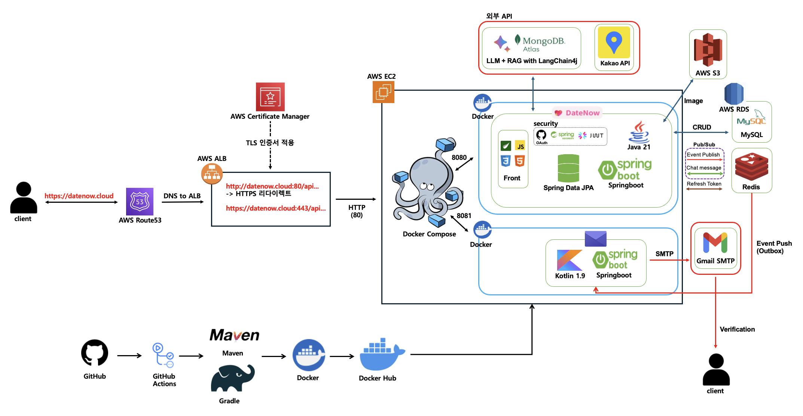

## AI 추천 흐름 (RAG)

```
사용자가 데이트 분위기 선택
        │
        ▼
AllMiniLmL6V2 (로컬 임베딩)
        │  벡터 변환
        ▼
MongoDB Atlas 벡터 검색
        │  유사 장소 추출 (유사도 0.6 이상)
        ▼
Google Gemini 2.5 Flash Lite
        │  컨텍스트 기반 추천 생성
        ▼
최종 추천 장소 5개 (JSON)
```

## 실시간 채팅 흐름

```
Client ──(WebSocket/STOMP)──▶ datenow ──▶ Redis Pub/Sub
Client ◀──(구독: /topic/{roomId})──────── Redis Pub/Sub
```

<br>

## ✏️ 7. ERD

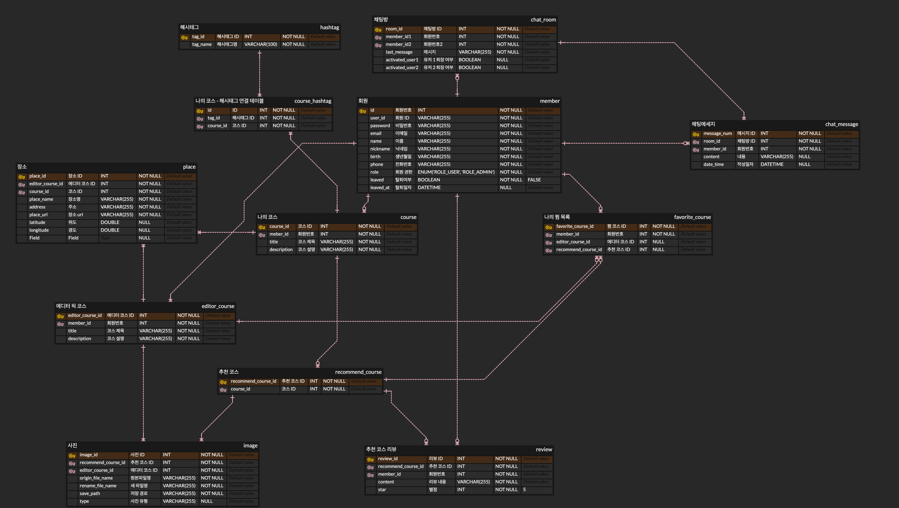

> [ERDCloud 바로가기](https://www.erdcloud.com/d/Ls8ZQ3QaPqZkgALS4)

<br>

## ✏️ 8. API 명세서
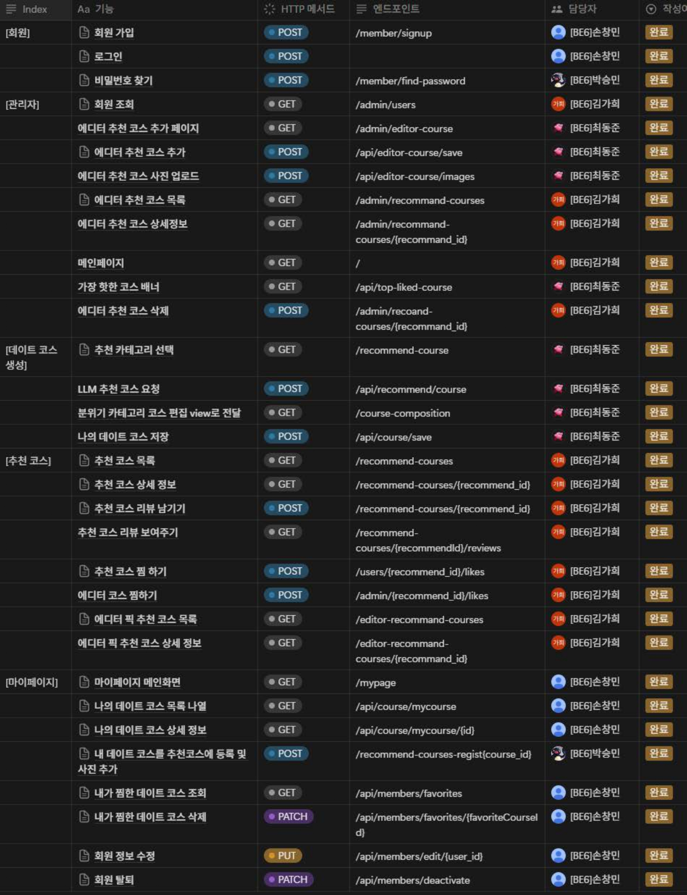

<br>

## ✏️ 9. 플로우차트
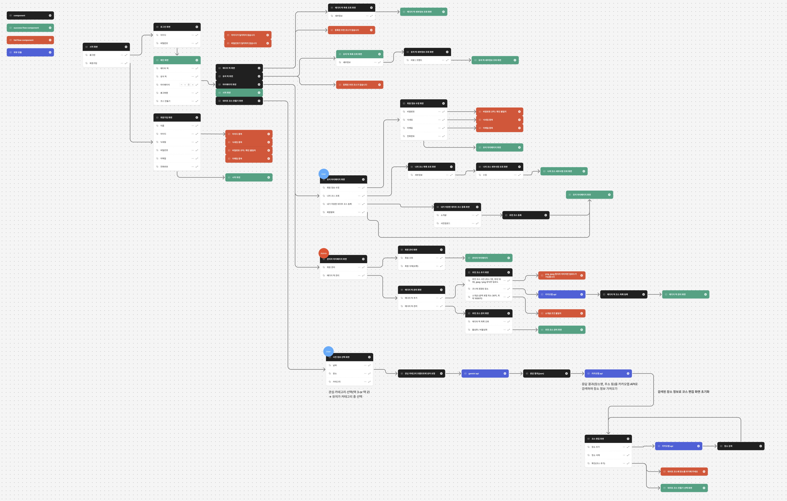

> [Figma 바로가기](https://www.figma.com/board/o8rODu37PW45r6JcEdBxAu/datenow-flow-chart?node-id=0-1&t=rOCzGASbGJNEjWjb-1)

<br>

## ✏️ 10. 화면 정의서
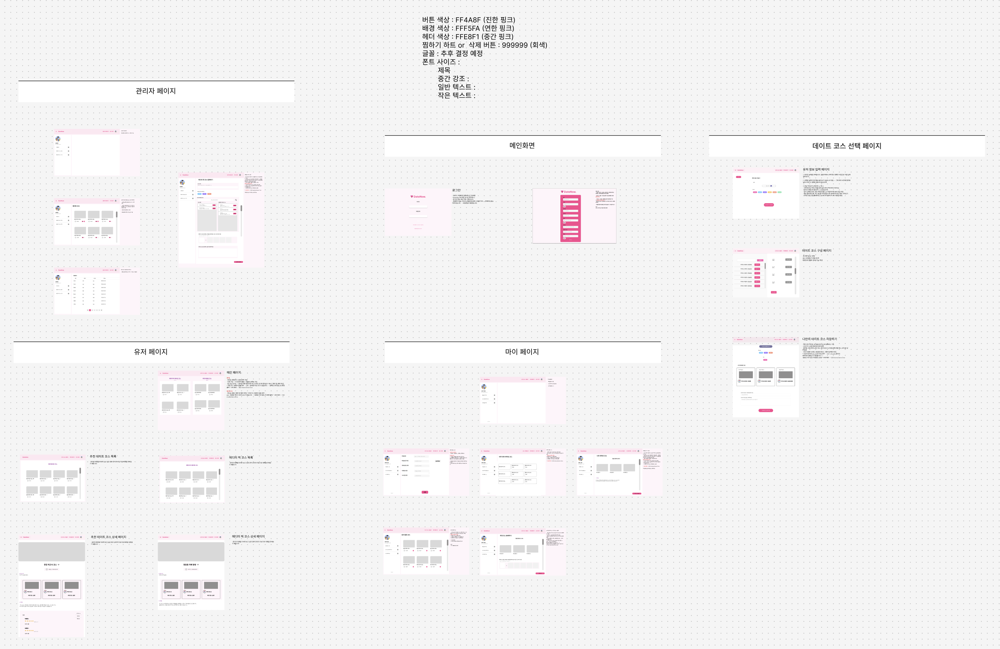

> [Figma 바로가기](https://www.figma.com/board/X7rIZPyQ8rPWEZs2lmy3B3/datenow---%ED%99%94%EB%A9%B4%EC%A0%95%EC%9D%98%EC%84%9C?node-id=0-1&t=f3XiNxOAtc3CfaYZ-1)

<br>

# 🕹️ 11. 실행 방법

## 필수 환경

- Java 21
- Docker & Docker Compose
- MySQL 8.x
- Redis
- MongoDB Atlas 계정

## 환경변수 설정

`application-prod.yml` 기준으로 아래 환경변수가 필요합니다.<br>

**datenow 서버**
```
DB_URL=jdbc:mysql://<host>:3306/datenow
DB_USERNAME=<username>
DB_PASSWORD=<password>

MONGODB_URI=mongodb+srv://<user>:<password>@<cluster>

REDIS_HOST=<host>
REDIS_USERNAME=<username>
REDIS_PASSWORD=<password>
REDIS_PORT=<port>

MAIL_PORT=587
MAIL_USERNAME=<gmail>
MAIL_PASSWORD=<app-password>

GITHUB_CLIENT_ID=<id>
GITHUB_CLIENT_SECRET=<secret>

JWT_SECRET=<secret>

KAKAO_API_KEY=<key>
GEMINI_API_KEY=<key>

AWS_ACCESS_KEY_ID=<key>
AWS_SECRET_ACCESS_KEY=<key>
```

**mail 서버**
```
APP_DOMAIN=<서비스 도메인>
MAIL_PORT=587
MAIL_USERNAME=<gmail>
MAIL_PASSWORD=<app-password>

REDIS_HOST=<host>
REDIS_USERNAME=<username>
REDIS_PASSWORD=<password>
REDIS_PORT=<port>
```

## 로컬 실행

```bash
# datenow 서버 (Java 21 + Maven)
cd datenow
./mvnw spring-boot:run -Dspring-boot.run.profiles=local

# mail 서버 (Kotlin + Gradle)
cd mail
./gradlew bootRun --args='--spring.profiles.active=local'
```

## Docker 빌드

```bash
# datenow
cd datenow
./mvnw clean package -DskipTests
docker build -t datenow .

# mail
cd mail
./gradlew bootJar
docker build -t datenow-mail .
```

<br>